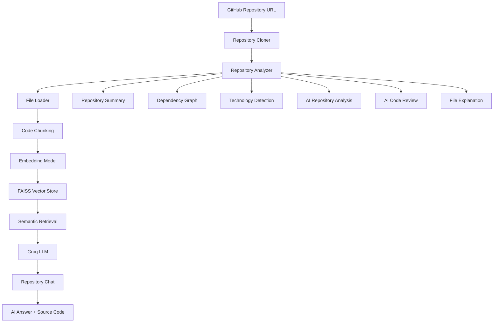
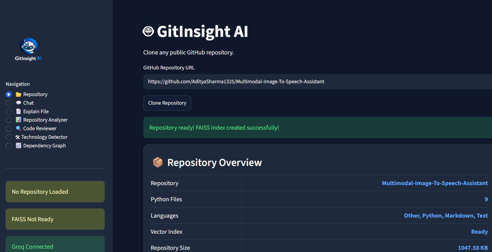
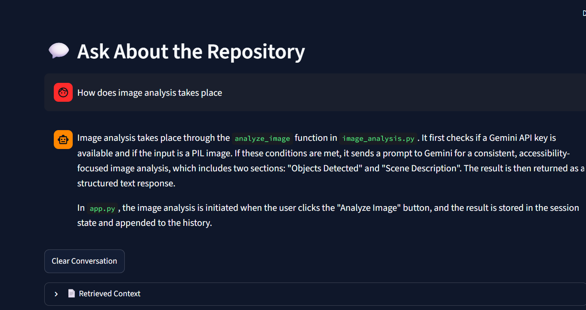
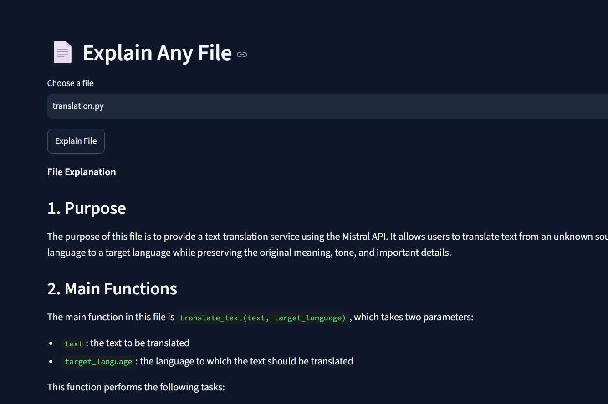
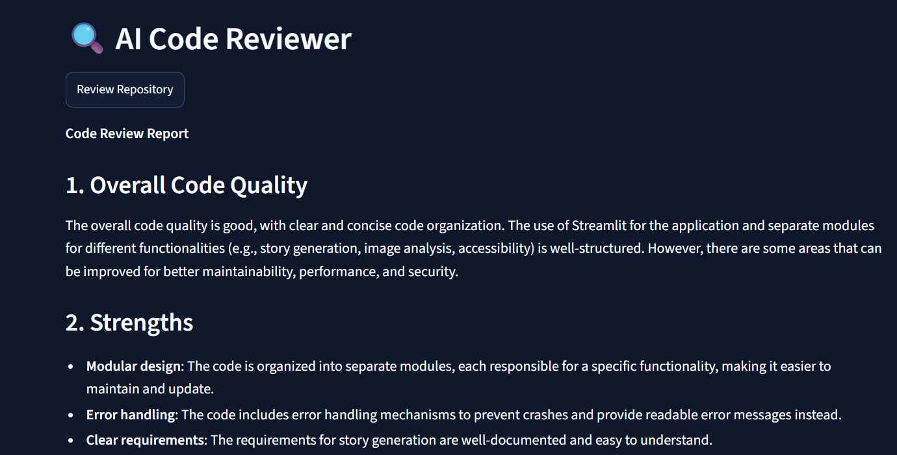
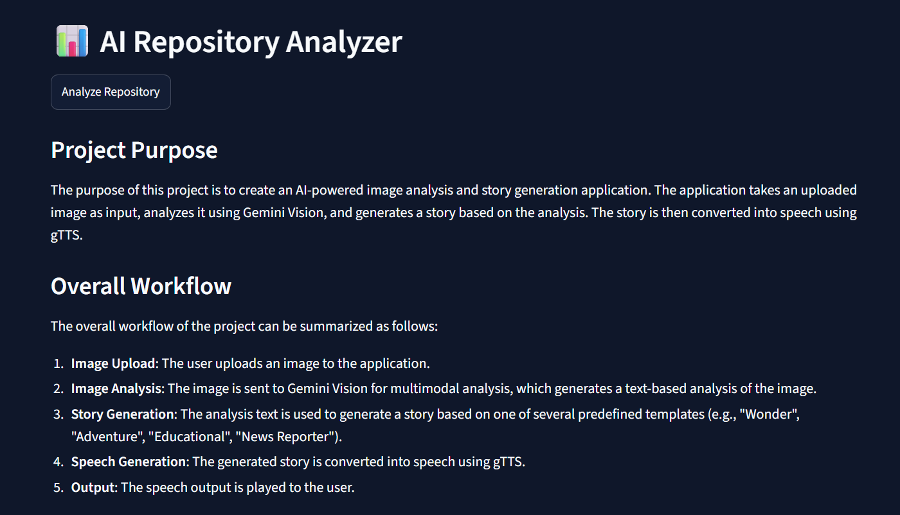
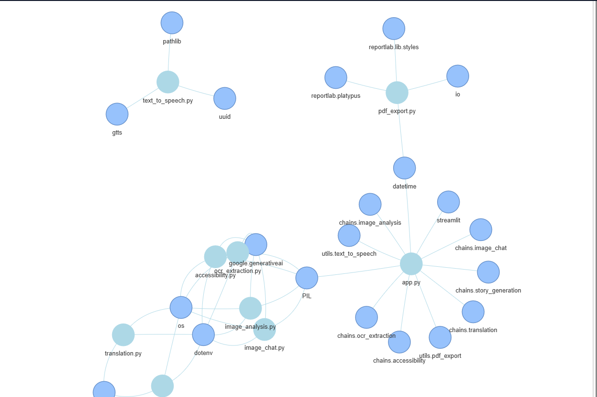

# 🤖 GitInsight AI – AI-Powered GitHub Repository Intelligence Platform

## 🚀 Overview

GitInsight AI is a production-style AI-powered GitHub Repository Intelligence Platform that enables developers to upload any public GitHub repository URL and interact with the codebase using natural language.

Instead of manually exploring hundreds of source files, GitInsight AI automatically clones the repository, analyzes its architecture, builds a semantic search index using FAISS, and leverages Retrieval-Augmented Generation (RAG) with Groq LLMs to answer repository-specific questions.

Beyond repository chat, the platform provides AI-powered code reviews, repository architecture analysis, file explanations, technology detection, dependency graph visualization, and conversational memory, making it an intelligent assistant for understanding unfamiliar codebases.

Unlike traditional AI chatbots, GitInsight AI grounds every response using retrieved source code, significantly reducing hallucinations and improving answer accuracy.

**🔗 Live Demo:** https://your-streamlit-app.streamlit.app/

---


# ✨ Features

## 📂 GitHub Repository Cloning

- Clone any public GitHub repository directly from its URL.
- Automatically validates repository URLs.
- Avoids duplicate cloning using local caching.

---

## 📊 Repository Overview

Automatically analyzes the repository and displays:

- Total files
- Programming languages
- Largest source files
- Repository statistics

---

## 📄 Intelligent Repository Ingestion

- Reads all supported source files.
- Ignores unnecessary folders like:

```
.git
node_modules
venv
__pycache__
```

- Supports multiple programming languages.

---

## ✂️ Smart Code Chunking

- Splits repository source code into optimized chunks.
- Preserves context using overlapping windows.
- Improves semantic retrieval performance.

---

## 🧠 Semantic Search using FAISS

- Generates embeddings for every code chunk.
- Stores vectors locally using FAISS.
- Retrieves the most relevant source code for every question.

---

## 🤖 AI Repository Chat (RAG)

Ask questions such as:

- How is authentication implemented?
- Explain the transaction categorization pipeline.
- How are reports generated?
- Where is Groq API used?

GitInsight AI retrieves relevant code before generating an answer.

---

## 💬 Conversational Memory

- Remembers previous questions.
- Supports follow-up queries naturally.
- Provides context-aware conversations.

---

## 📄 Explain Any File

Select any source file and receive:

- File purpose
- Workflow explanation
- Important functions
- Suggestions for improvement

---

## 🔍 AI Code Reviewer

Automatically reviews the entire repository and provides:

- Code quality assessment
- Best practice recommendations
- Performance improvements
- Readability suggestions
- Security observations

---

## 📊 AI Repository Analyzer

Generates an executive summary describing:

- Repository purpose
- Architecture
- Project workflow
- Major components
- Overall design

---

## 🛠 Technology Stack Detection

Automatically detects technologies used inside the repository, including:

- Frameworks
- Programming languages
- AI libraries
- Databases
- Build tools

---

## 📈 Repository Dependency Graph

Visualizes relationships between repository files by analyzing import dependencies.

Helps developers quickly understand project architecture.

---

## ⚡ Fast Local Vector Search

- Embeddings generated once.
- Stored locally in FAISS.
- Enables low-latency semantic search.

---

# 🏗️ System Architecture



---

# 🛠 Tech Stack

## Frontend

- Streamlit

## LLM Framework

- LangChain

## Large Language Model

- Groq (Llama 3.1)

## Vector Database

- FAISS

## Embedding Model

- sentence-transformers/all-MiniLM-L6-v2

## Version Control

- GitPython

## Static Code Analysis

- Python AST

## Visualization

- PyVis

## Programming Language

- Python

---

# 📂 Project Structure

```
GitInsight-AI/

├── app.py
├── requirements.txt
├── README.md
├── assets/
│   ├── logo.png
│   ├── style.css
│
├── cloned_repos/
│
├── faiss_index/
│
├── src/
│
│── github/
│     clone_repo.py
│
│── parser/
│     file_loader.py
│     chunker.py
│     repository_files.py
│
│── embeddings/
│     embedding_model.py
│
│── vectorstore/
│     faiss_store.py
│
│── retrieval/
│     search.py
│
│── llm/
│     rag_chat.py
│
│── review/
│     code_review.py
│
│── analysis/
│     repo_summary.py
│     ai_repository.py
│
│── explainer/
│     file_explainer.py
│
│── detector/
│     technology_detector.py
│
│── graph/
│     dependency_graph.py
```

---

# 🔄 Workflow

### Step 1: Clone Repository

User enters a GitHub repository URL.

---

### Step 2: Repository Analysis

The application:

- Validates URL
- Clones repository
- Computes repository statistics

---

### Step 3: Repository Ingestion

The system:

- Reads supported files
- Filters ignored directories
- Loads source code

---

### Step 4: Code Chunking

Source code is split into overlapping chunks.

---

### Step 5: Embedding Generation

Embeddings are generated using Sentence Transformers.

---

### Step 6: FAISS Indexing

Embeddings are stored inside a FAISS vector database.

---

### Step 7: Semantic Retrieval

Relevant code chunks are retrieved using similarity search.

---

### Step 8: AI Answer Generation

Groq LLM generates answers grounded in retrieved repository code.

---

### Step 9: Additional AI Analysis

Users can:

- Review the repository
- Explain any file
- Detect technologies
- Generate dependency graphs
- Analyze repository architecture

---

# 🎯 Example Use Cases

## Software Engineering

Understand unfamiliar repositories quickly.

---

## AI Engineering

Analyze AI and ML repositories.

---

## Open Source Contribution

Understand project architecture before contributing.

---

## Code Review

Receive AI-generated repository quality assessments.

---

## Learning

Explore large repositories interactively.

---

# 📸 Application Screenshots

### 🏠 Repository Dashboard



---

### 💬 AI Repository Chat



---

### 📄 File Explainer



---

### 🔍 AI Code Reviewer



---

### 📊 Repository Analyzer



---

### 📈 Dependency Graph



---

# 🔒 Hallucination Reduction Strategy

GitInsight AI follows a Retrieval-Augmented Generation (RAG) architecture.

Instead of allowing the LLM to answer from general knowledge:

- Repository code is retrieved first.
- Only relevant code chunks are sent to the LLM.
- Source code context is displayed alongside answers.
- Responses remain grounded in the repository.

This significantly reduces hallucinations compared to traditional AI assistants.

---

# 📈 Future Improvements

- Hybrid Search (BM25 + Vector Search)
- Multi-Repository Chat
- GitHub Pull Request Review
- Commit History Analysis
- Repository Comparison
- Architecture Diagram Generation
- Docker Deployment
- Kubernetes Deployment
- Cloud Vector Database Support
- CI/CD Integration

---

# ⚙️ Installation & Setup

## 1. Clone Repository

```bash
git clone https://github.com/yourusername/GitInsight-AI.git

cd GitInsight-AI
```

---

## 2. Create Virtual Environment

```bash
python -m venv venv
```

Windows

```bash
venv\Scripts\activate
```

Linux / macOS

```bash
source venv/bin/activate
```

---

## 3. Install Dependencies

```bash
pip install -r requirements.txt
```

---

## 4. Configure Environment Variables

Create a `.env` file.

```env
GROQ_API_KEY=YOUR_GROQ_API_KEY
```

---

## 5. Run Application

```bash
python -m streamlit run app.py
```

---

## 6. Open Browser

```
https://your-streamlit-app.streamlit.app/
```

---

# 👨‍💻 Author

**Aditya Sharma**

Computer Science Engineering Student | AI & Machine Learning Enthusiast

Focused on:

- Artificial Intelligence
- Retrieval-Augmented Generation (RAG)
- LLM Applications
- AI Engineering
- Machine Learning
- Vector Databases
- Software Engineering

---

# ⭐ Key Learning Outcomes

This project demonstrates:

- End-to-End RAG Pipeline Development
- GitHub Repository Analysis
- Retrieval-Augmented Generation (RAG)
- FAISS Vector Database Integration
- Embedding-Based Semantic Search
- Prompt Engineering
- Static Code Analysis using Python AST
- AI Code Review Systems
- Repository Architecture Understanding
- Dependency Graph Generation
- LangChain Application Development
- Streamlit Dashboard Development
- Production-Oriented AI System Design
